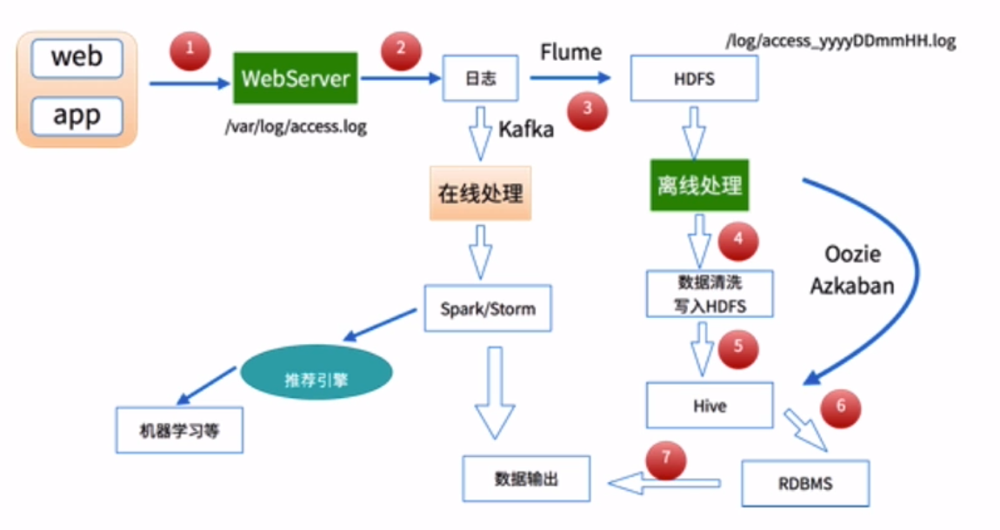

# LogAnalysis

慕课网日志分析项目

# 目录结构

- resources
用于解析ip的两份文件

- SparkLogAnalysis
基于Spark分析imooc日志文件的程序

- SparkWeb
ECharts可视化展示

# 项目概述

## 离线数据处理架构



- 数据采集

  Flume： web日志写入到HDFS

- 数据清洗

  脏数据
  
  Spark、Hive、MapReduce 或者是其他的一些分布式计算框架 
  
  清洗完之后的数据可以存放在HDFS(Hive/Spark SQL)

- 数据处理

  按照我们的需要进行相应业务的统计和分析
  
  Spark、Hive、MapReduce 或者是其他的一些分布式计算框架

- 数据处理结果入库

  结果可以存放到RDBMS、NoSQL

- 数据的可视化展示

  通过图形化展示的方式展现出来：饼图、柱状图、地图、折线图
  
  ECharts、HUE、Zeppelin

## 项目需求

- 需求一：统计imooc主站最受欢迎的课程/手记的Top N访问次数
最终结果以可视化的方式进行展示(ECharts)

- 需求二：按地市统计imooc主站最受欢迎的Top N课程
根据IP地质提取出城市信息(借助一个开源项目)
**窗口函数**在Spark SQL中的使用

- 需求三：按流量统计imooc主站最受欢迎的Top N课程

## ipdatabase的使用

克隆项目到本地:
```
git clone https://github.com/wzhe06/ipdatabase.git
```

编译下载的项目:
```
mvn clean package -DskipTests
```

安装jar包到自己的maven仓库:
```
mvn install:install-file -Dfile=/Users/lemon/source/ipdatabase/target/ipdatabase-1.0-SNAPSHOT.jar -DgroupId=com.ggstar -DartifactId=ipdatabase -Dversion=1.0 -Dpackaging=jar
```

在pom.xml中添加以下内容：
```
<dependency>
  <groupId>com.ggstar</groupId>
  <artifactId>ipdatabase</artifactId>
  <version>1.0</version>
</dependency>

<dependency>
  <groupId>org.apache.poi</groupId>
  <artifactId>poi-ooxml</artifactId>
  <version>3.14</version>
</dependency>

<dependency>
  <groupId>org.apache.poi</groupId>
  <artifactId>poi</artifactId>
  <version>3.14</version>
</dependency>
```

产生报错:
```
java.io.FileNotFoundException: 
file:/Users/lemon/maven_repos/com/ggstar/ipdatabase/1.0/ipdatabase-1.0.jar!/ipRegion.xlsx (No such file or directory)
```

解决方案:
将 **ipDatabase.csv** 和 **ipRegion.xlsx** 这2个文件 拷贝到resources下

## 数据库中相关表的创建
```
mysql> create database imooc_project;
```

需求一的表：
```
mysql> create table day_video_access_topn_stat (
day varchar(8) not null,
cms_id bigint(10) not null,
times bigint(10) not null,
primary key (day, cms_id)
);
```

需求二的表：
```
mysql> create table day_video_city_access_topn_stat (
day varchar(8) not null,
cms_id bigint(10) not null,
city varchar(20) not null,
times bigint(10) not null,
times_rank int not null,
primary key (day, cms_id, city)
);
```

查询结果，按照times_rank以升序进行排序：
```
mysql> select * from day_video_city_access_topn_stat order by city desc, times_rank asc;
```

需求三的表：
```
mysql> create table day_video_traffics_topn_stat (
day varchar(8) not null,
cms_id bigint(10) not null,
traffics bigint(20) not null,
primary key (day, cms_id)
);
```

## 可视化展示效果


